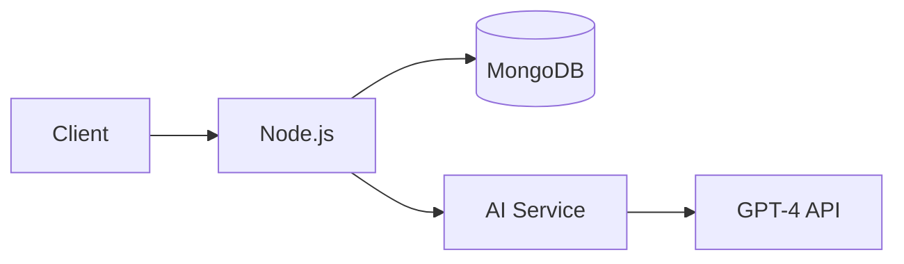

# DebateSphere - AI-Powered Argumentation Platform

## Web Interface

DebateSphere is an AI-powered platform that helps users master persuasive communication through realistic debate simulations. The web application provides an interactive environment to practice argumentation against an adaptive AI opponent.

## Features

✨ **Core Features**:
- Real-time AI-powered debates
- Voice interaction using Web Speech API
- Performance analytics and feedback
- Extensive topic library
- Responsive design for all devices

🎯 **Skill Development**:
- Critical thinking
- Argument structure
- Rebuttal techniques
- Public speaking
- Persuasive communication

## Technology Stack

### Frontend
- HTML5, CSS3, JavaScript
- CSS Animations & Transitions
- Responsive Design (Mobile-first)
- Web Speech API (Voice Recognition/Synthesis)

### Backend (Conceptual)
| Component       | Technology Choices          |
|-----------------|----------------------------|
| Server          | Node.js/Express.js         |
| Database        | MongoDB/PostgreSQL         |
| AI Integration  | GPT-4/Claude API           |
| Real-time       | WebSocket/Socket.io        |
| Authentication  | JWT/OAuth 2.0              |

## 🤝 Contribute
Found a bug? Have a feature request?
Open an issue or submit a PR!

## 📜 License
MIT © 2025 Dishank Singh
